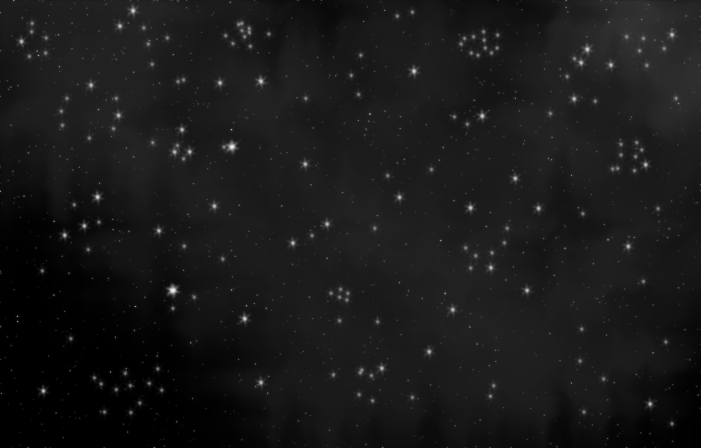
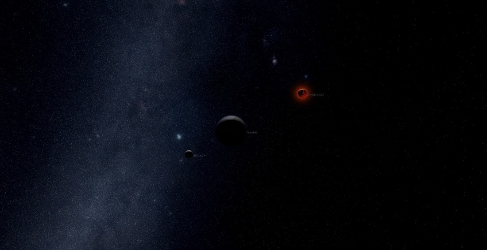
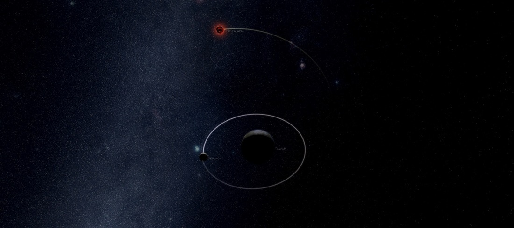
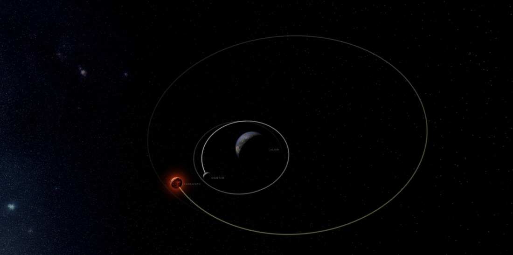
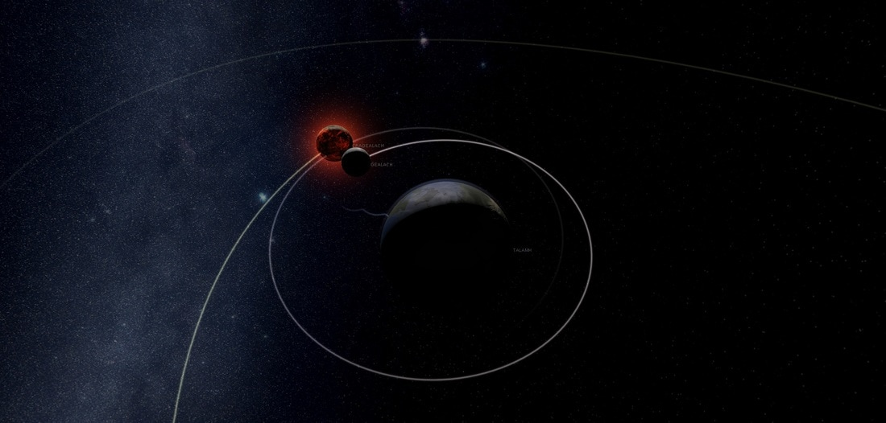

# Temuair Astronomy

*by Suspected in **Dark Ages***

This document contains the observational study of the Temuair planetary bodies surrounding the world in which we live. The scientific methods I used for this study were through lens enhancement with the assistance of Wizard Jean of Loures Castle. With what Jean and I have dubbed a telescope, we have mapped the visible celestial bodies in the night sky, and placed them with the use of conscription magic on to this parchment. This document contains a complete star map and scientific observations of the object known as the Blood Moon.

## Temuairian Star Map

  
*The star map of the sky as seen in Temuair and Medenia.*

Within this map, the constellations first observed by Ceannlaidir High Priestess Solanalein can be seen throughout the sky, however this map is not to document the constellations, but rather to show the entirety of the visible sky.

## Cragealach (Blood Moon)

Cragealach, or the blood moon, as we Aislings call it, has been something of an anomaly for quite some time and the center for speculation for many Deochs. Over a period of time I have studied the sky while compiling information and have done so on our closest celestial bodies in the process, and I have to present here an unfounded discovery in which the Blood Moon is actually an entirely separate object orbiting this world.

  
*Cragealach and Gealach in orbit around Talamh.*

Cragealach, or the Blood Moon, is actually a secondary moon in orbit around Talamh (Our world). As near as I can see, the moon was not always part of the Talamh and Gealach (Moon) orbital structure, as given the math through my observations suggest it’s an addition in a very recent timeframe.  

R³ = [ ((2.35x10⁶ s)² • (6.673 x 10⁻¹¹ N m²/kg²) • (5.98x10²⁴ kg) ) / (4 • (3.1415)²) ]  
R³ = 5.58 x 10²⁵ m³  

Given the mathematics behind the orbit of Cragealach, the moon appears to have an origin somewhere on the other side of Grian (The Sun). When I traced the orbit backwards, I learned something astonishing, the Cragealach departed from another planet after it exploded, passing so close to Grian it was soaked in radiation, giving it the red color. Eventually Cragealach settled in a deteriorating orbit around Talamh and this is where it remains to this very Deoch.

  
*Cragealach makes its farthest descend from Talamh.*

Because of the deteriorating orbit of the Cragealach, a few variables come into play. Since the arrival of this blood moon is fairly new, it has not settled into a perfect orbit around Talamh, and instead acts as though it’s being forcibly pulled in and then shot back out in an oval pattern opposed to circular. This creates a problem for astronomers because the deterioration is random, and changing all the time, it does not behave like one would predict our own Gealach would, this leads me to believe it has an unusual composition, the difference between a ball made of steel and a ball made of wood under water, behaviorally.

  
*Cragealach makes its first pass around Talamh after arrival.*

As near as I can tell with the current orbits of both Gealach and Cragealach, the earliest point in time I can calculate in the arrival of the new gealach caused a pull on our own gealach at the time, the change was subtle, and the effects of pulling our gealach away from Talamh would of caused a massive series of floods, destroying any civilization inhabiting the world at that time. Since most of our documentation from those periods are lost, one can only conjecture as to how damaging the coming forces would of been.

  
*Cragealach orbits Talamh, passing close by Gealach during this last Blood Moon.*

Unlike in its previous cycles around Talamh, the Cragealach began to become less chaotic in its orbit, although it is still deteriorating, and our two moons have come to a sort of chaotic harmony, as no longer does their gravity affect one another. It’s reasonable to conjecture this is because Cragealach oribits Talamh precisely the same time Gealach makes a pass, causing no visible pull on either Cragealach, Gealach, or Talamh. With the current models however I say with certainty that eventually Cragealach will collide with our Gealach, and the result will be destruction on such a massive scale we could not comprehend its consequences, however even with its deteriorating orbit, my math shows it would not be possible at least for another 500,000 Deochs.

The Cragealach as a whole has a mysterious effect on Aislings in our world annually. When it reaches its closest point to Talamh, it eclipses with gealach and causes what we have dubbed the Blood Moon, and its radiation emanating from around gealeach causes Aisling to turn into demons of the Dubhamid. Nothing else is known as to why, although I suspect while in transit from its previous host the Grian superheated Cragealach and whatever its composition interacts with Aislings on a cellular level, there just isn’t enough data to explain why or how this happens, so instead I have presented the means in which the pieces move on our celestial map. Perhaps those more intelligent than I can use this information for greater understanding of why they are the way they are. I leave the rest to the philosophers and historians of the land.

-Suspected Star  
  Astronomer


```
*Librarian Notes*

This entry has been edited to conform to Library formatting.
The original can be found at https://talamhtemuair.weebly.com/ .
This was awarded Kingdom in Deoch 148
```
